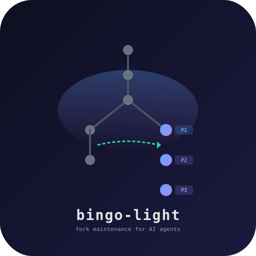

<p align="center">
  <br>
  
  <br><br>
  <strong>Fork maintenance for humans and AI agents.<br>One command to sync. Zero dependencies.</strong>
  <br><br>
  <b>English</b> | <a href="README.md">简体中文</a>
  <br><br>
  <a href="https://github.com/DanOps-1/bingo-light/actions"></a>
  <a href="LICENSE"></a>
  <a href="https://github.com/DanOps-1/bingo-light/releases"></a>
  <br>
  <a href="#for-ai-agents"></a>
  <a href="https://www.python.org/"></a>
  
  <a href="https://github.com/DanOps-1/bingo-light/stargazers"></a>
  <br><br>
</p>

---

GitHub's "Sync fork" button breaks the moment you have customizations. `git rebase` is a 6-step ritual. And none of it works from an AI agent.

**bingo-light fixes all three.**

Your patches live as a clean, named stack on top of upstream. Syncing is `bingo-light sync`. Conflicts get remembered so you never solve the same one twice. And if something goes sideways, `bingo-light undo` puts everything back in one second.

Every command speaks JSON. The built-in MCP server gives AI agents 49 tools to manage your fork autonomously -- from init through conflict resolution. No human in the loop required.

---

<p align="center">
  
</p>

---

## Quick Start

```bash
# Install (pick one)
pip install bingo-light             # Python
npm install -g bingo-light          # Node.js
brew install DanOps-1/tap/bingo-light  # Homebrew

# Point at upstream
cd your-forked-project
bingo-light init https://github.com/original/project.git

# Sync whenever you want -- patches rebase on top automatically
bingo-light sync
```

That's it. Three commands and your fork stays in sync forever.

## Demo

### Basic workflow: init, patch, sync

<p align="center">
  
</p>

### Conflict resolution: sync, analyze, resolve

<p align="center">
  
</p>

> The AI calls `conflict-analyze --json`, reads the structured ours/theirs data, writes the merged file, and the rebase continues. No human needed.

During a rebase, `conflict-analyze` returns a full situational briefing:
- **`patch_intent`** — patch name, subject, full commit message, original SHA, original diff, metadata, stack position.
- **`verify`** — configured `test.command` + per-file syntax/parse hints by extension (`.py/.json/.yml/.yaml/.toml/.sh`).
- **`upstream_context`** — upstream commits touching conflicts, with author, subject, and extracted PR numbers.
- **`patch_dependencies`** — later patches in your stack that modify overlapping files (cascade risk).
- **`decision_memory`** — prior resolutions for this patch from `.bingo/decisions/`, ranked by relevance.
- Each `conflicts[]` entry carries **`semantic_class`**: `whitespace` / `import_reorder` / `signature_change` / `logic`.

`conflict-resolve --verify` (CLI) or `verify: true` (MCP) runs `test.command` after the final `git rebase --continue`; the result is attached as `verify_result`. `conflict-resolve` also auto-records the decision (file, semantic class, strategy) to decision memory.

---

## Key Features

### For Humans

- :wrench: **Zero deps** -- just Python 3 + git. `pip install bingo-light` and go.
- :bookmark_tabs: **Named patch stack** -- each customization is one atomic, named commit. No more guessing which changes are yours.
- :zap: **One-command sync** -- `bingo-light sync` fetches upstream and rebases your patches on top. Done.
- :brain: **Conflict memory** -- git rerere auto-enabled. Resolve a conflict once, never resolve it again.
- :rewind: **Instant undo** -- `bingo-light undo` restores pre-sync state. No reflog spelunking.
- :crystal_ball: **Conflict prediction** -- `status` warns you about risky files before you sync.
- :test_tube: **Dry-run mode** -- `sync --dry-run` tests on a throwaway branch first.
- :stethoscope: **Built-in doctor** -- full diagnostic with test rebase to catch problems early.
- :package: **Export/Import patches** -- share as `.patch` files, quilt-compatible format.
- :robot: **Auto-sync CI** -- generates a GitHub Actions workflow with conflict alerting.
- :tv: **TUI dashboard** -- curses-based real-time monitoring via `contrib/tui.py`.
- :globe_with_meridians: **Multi-repo workspace** -- manage multiple forks from one place.
- :bell: **Notification hooks** -- Slack, Discord, webhooks on sync/conflict/test events.
- :label: **Patch metadata** -- tags, reasons, expiry dates, upstream PR tracking.
- :tab: **Shell completions** -- tab completion for bash, zsh, and fish.

### For AI Agents

- :electric_plug: **MCP server (49 tools)** -- full fork management from init through conflict resolution.
- :bar_chart: **`--json` on everything** -- every command returns structured JSON. Parse, don't scrape.
- :mute: **`--yes` flag** -- fully non-interactive. No TTY required. No prompts. Ever.
- :gear: **Auto-detect non-TTY** -- pipes and subprocesses trigger non-interactive mode automatically.
- :memo: **`BINGO_DESCRIPTION` env var** -- set patch descriptions without stdin.
- :mag: **`conflict-analyze --json`** -- structured conflict data: file, ours, theirs, resolution hints.
- :white_check_mark: **`conflict-resolve`** -- write resolved content via MCP, auto-stage, continue rebase. Zero manual intervention.
- :package: **Dependency patching** -- `dep patch/apply/sync` for npm/pip packages. Patches survive `npm install`.
- :satellite: **Advisor agent** -- `contrib/agent.py` monitors drift, analyzes risk, auto-syncs when safe.

---

## Installation

Install with any package manager, then run `bingo-light setup` to interactively configure MCP for your AI tools (Claude Code, Cursor, Windsurf, VS Code/Copilot, Zed, Gemini CLI, etc.).

### pip / pipx

```bash
pip install bingo-light        # or: pipx install bingo-light
bingo-light setup              # interactive — pick which AI tools to configure
```

### npm / npx

```bash
npm install -g bingo-light     # global install
bingo-light setup

# Or use npx — no install needed:
npx bingo-light setup
```

MCP clients can use npx directly:
```json
{"command": "npx", "args": ["-y", "bingo-light-mcp"]}
```

### Homebrew

```bash
brew install DanOps-1/tap/bingo-light
bingo-light setup
```

### Docker

```bash
# CLI
docker run --rm -v "$PWD:/repo" -w /repo ghcr.io/danops-1/bingo-light status

# MCP server (stdio transport)
docker run --rm -i -v "$PWD:/repo" -w /repo ghcr.io/danops-1/bingo-light mcp-server.py
```

### Shell installer

```bash
curl -fsSL https://raw.githubusercontent.com/DanOps-1/bingo-light/main/install.sh | sh

# Non-interactive (CI / Docker)
curl -fsSL .../install.sh | sh -s -- --yes
```

### From source

```bash
git clone https://github.com/DanOps-1/bingo-light.git
cd bingo-light
make install && bingo-light setup
```

**Requirements:** Python 3.8+, git 2.20+. Zero pip dependencies.

---

## How It Works

```
  upstream (github.com/original/project)
      |
      |  git fetch
      v
  upstream-tracking ──────── exact mirror of upstream, never touched
      |
      |  git rebase
      v
  bingo-patches ────────────  your customizations stacked here
      |
      +── [bl] custom-scheduler:  O(1) task scheduling
      +── [bl] perf-monitoring:   eBPF tracing hooks
      +── [bl] fix-logging:       structured JSON logs
      |
      v
    HEAD (your working fork)
```

**Sync flow:** fetch upstream, fast-forward the tracking branch, rebase your patches on top. Your patches always sit cleanly on the latest upstream.

**Conflict memory:** `init` auto-enables git rerere. Resolve a conflict once and git remembers the resolution. Next sync applies it automatically. bingo-light detects auto-resolved conflicts and continues the rebase without stopping.

**AI conflict flow:** rebase hits a conflict, the AI calls `conflict-analyze` for structured data (ours/theirs/hints per file), writes the resolution via `conflict-resolve`, and rebase continues. No human in the loop.

---

## For AI Agents

bingo-light was designed from day one for AI agents. Every command speaks JSON. The MCP server exposes 49 tools covering the full lifecycle from `init` to `conflict-resolve`. Non-interactive mode is the default when stdin is not a TTY.

### MCP setup -- Claude Code

Add to `.mcp.json` in your project root or `~/.claude/settings.json`:

```json
{
  "mcpServers": {
    "bingo-light": {
      "command": "python3",
      "args": ["/path/to/bingo-light/mcp-server.py"]
    }
  }
}
```

### MCP setup -- Claude Desktop

Add to `~/Library/Application Support/Claude/claude_desktop_config.json`:

```json
{
  "mcpServers": {
    "bingo-light": {
      "command": "python3",
      "args": ["/path/to/bingo-light/mcp-server.py"]
    }
  }
}
```

**Any MCP client** (VS Code Copilot, Cursor, custom agents): connect via stdio to `python3 mcp-server.py`.

### 49 MCP Tools

| Tool | Purpose |
|------|---------|
| `bingo_init` | Initialize fork tracking |
| `bingo_status` | Fork health: drift, patches, conflict risk |
| `bingo_sync` | Fetch upstream + rebase patches |
| `bingo_undo` | Revert to pre-sync state |
| `bingo_patch_new` | Create a named patch |
| `bingo_patch_list` | List patch stack with stats |
| `bingo_patch_show` | Show patch diff |
| `bingo_patch_drop` | Remove a patch |
| `bingo_patch_export` | Export as `.patch` files |
| `bingo_patch_import` | Import `.patch` files |
| `bingo_patch_meta` | Get/set patch metadata |
| `bingo_patch_squash` | Merge two patches into one |
| `bingo_patch_reorder` | Reorder patches non-interactively |
| `bingo_doctor` | Full diagnostic with test rebase |
| `bingo_diff` | Combined diff vs upstream |
| `bingo_auto_sync` | Generate GitHub Actions workflow |
| `bingo_conflict_analyze` | Structured conflict data for AI resolution |
| `bingo_conflict_resolve` | Write resolution, stage, continue rebase |
| `bingo_config` | Get/set configuration |
| `bingo_history` | Sync history with hash mappings |
| `bingo_test` | Run configured test suite |
| `bingo_workspace_status` | Multi-repo workspace overview |
| `bingo_patch_edit` | Amend an existing patch |
| `bingo_workspace_init` | Initialize multi-repo workspace |
| `bingo_workspace_add` | Add a repo to workspace |
| `bingo_workspace_sync` | Sync all workspace repos |
| `bingo_workspace_list` | List workspace repos |

### JSON examples

```bash
# Fork status (AI-friendly)
bingo-light status --json
```

```json
{
  "ok": true,
  "upstream_url": "https://github.com/torvalds/linux.git",
  "behind": 47,
  "patch_count": 2,
  "patches": [
    {"name": "custom-scheduler", "hash": "a3f7c21", "subject": "O(1) task scheduling", "files": 3},
    {"name": "perf-monitoring", "hash": "b8e2d4f", "subject": "eBPF tracing hooks", "files": 5}
  ],
  "conflict_risk": ["kernel/sched/core.c"]
}
```

```bash
# Conflict analysis (structured data for AI resolution)
bingo-light conflict-analyze --json
```

```json
{
  "rebase_in_progress": true,
  "current_patch": "custom-scheduler",
  "conflicts": [
    {
      "file": "kernel/sched/core.c",
      "conflict_count": 2,
      "ours": "... upstream version ...",
      "theirs": "... your patch version ...",
      "hint": "Upstream refactored scheduler core; patch needs to target new structure."
    }
  ]
}
```

### End-to-end AI workflow

```
User: "Sync my fork and fix any conflicts."

AI Agent:
  1. bingo_status(cwd)                   -> 47 behind, risk: core.c
  2. bingo_sync(cwd, dry_run=true)       -> 1 conflict predicted
  3. bingo_sync(cwd)                     -> rebase stops at conflict
  4. bingo_conflict_analyze(cwd)         -> structured ours/theirs/hints
  5. AI reads both versions, generates merge
  6. bingo_conflict_resolve(cwd, file, content)  -> resolved, rebase continues
  7. bingo_status(cwd)                   -> 0 behind, all patches clean
```

### CLI integration (Aider, custom agents)

```bash
bingo-light status --json          # Parse fork state
bingo-light sync --yes             # Non-interactive sync
bingo-light conflict-analyze --json # Structured conflict data
```

```python
import subprocess, json

def bingo(cmd, cwd="/path/to/repo"):
    result = subprocess.run(
        ["bingo-light"] + cmd.split() + ["--json", "--yes"],
        cwd=cwd, capture_output=True, text=True
    )
    return json.loads(result.stdout)

status = bingo("status")
if status["behind"] > 0:
    result = bingo("sync")
    if result.get("conflicts"):
        analysis = bingo("conflict-analyze")
        # AI resolves each conflict...
```

---

## Command Reference

```
bingo-light init <upstream-url> [branch]      Set up upstream tracking
bingo-light sync [--dry-run] [--force]        Sync with upstream
bingo-light sync --test                       Sync + run tests, undo on failure
bingo-light undo                              Revert to pre-sync state
bingo-light status                            Fork health + conflict prediction
bingo-light diff                              Combined patch diff vs upstream
bingo-light doctor                            Full diagnostic
bingo-light log                               Sync history
bingo-light history                           Detailed sync history with hash mappings
bingo-light patch new <name>                  Create named patch from staged changes
bingo-light patch list [-v]                   List patch stack
bingo-light patch show <name|index>           Show patch diff
bingo-light patch edit <name|index>           Amend a patch (stage changes first)
bingo-light patch drop <name|index>           Remove a patch
bingo-light patch reorder [--order "3,1,2"]   Reorder patches
bingo-light patch export [dir]                Export as .patch files
bingo-light patch import <file|dir>           Import .patch files
bingo-light patch squash <idx1> <idx2>        Merge two patches
bingo-light patch meta <name> [key] [value]   Get/set patch metadata
bingo-light conflict-analyze                  Structured conflict data for AI
bingo-light config get|set|list [key] [val]   Manage configuration
bingo-light test                              Run configured test suite
bingo-light dep patch <package> [name]         Patch a modified npm/pip dependency
bingo-light dep apply [package]               Re-apply dependency patches after install
bingo-light dep sync                          Re-apply after update + detect conflicts
bingo-light dep status                        Dependency patch health check
bingo-light dep list                          List all dependency patches
bingo-light dep drop <package> [patch]        Remove a dependency patch
bingo-light workspace init|add|status|sync    Multi-repo management
bingo-light auto-sync                         Generate GitHub Actions workflow
bingo-light version                           Print version
bingo-light help                              Show usage
```

**Global flags:** `--json` (structured output) | `--yes` / `-y` (skip all prompts)

---

## Why not just...

<details>
<summary><b>...click GitHub's "Sync fork" button?</b></summary>
<br>

It only does fast-forward. The moment you have any customizations (commits on your fork that aren't in upstream), it either refuses or creates a merge commit that buries your changes. It has no concept of a patch stack, no conflict memory, and no API for AI agents.
</details>

<details>
<summary><b>...use <code>git rebase</code> manually?</b></summary>
<br>

You can. It takes 6 steps: fetch, checkout tracking branch, pull, checkout patches branch, rebase, push. You need to remember which branch is which, manually enable rerere, and hope you don't mess up the reflog if something goes wrong. bingo-light wraps all of this into `bingo-light sync` with automatic undo, conflict prediction, and structured output.
</details>

<details>
<summary><b>...use StGit / quilt / TopGit?</b></summary>
<br>

StGit (649 stars) manages patch stacks but has no AI integration, no MCP server, no JSON output, and no conflict prediction. quilt operates outside git entirely -- no rerere, no history. TopGit is effectively abandoned. None of them were designed for the AI-agent era.
</details>

## Comparison

| | **bingo-light** | GitHub Sync | git rebase | quilt | StGit |
|---|:---:|:---:|:---:|:---:|:---:|
| Named patch stack | **Yes** | No | No | Yes | Yes |
| One-command sync | **Yes** | Click only | No (6 steps) | No | No |
| Handles customizations | **Yes** | **No** | Manual | Manual | Manual |
| Conflict memory (rerere) | **Auto** | No | Manual | No | No |
| Conflict prediction | **Yes** | No | No | No | No |
| AI / MCP integration | **49 tools** | No | No | No | No |
| JSON output | **All commands** | No | No | No | No |
| Non-interactive mode | **Native** | No | Partial | Partial | Partial |
| Undo sync | **One command** | No | git reflog | Manual | Manual |
| Install | One command | Built-in | Built-in | Package mgr | Package mgr |

---

## FAQ

<details>
<summary><b>Why not just <code>git rebase</code>?</b></summary>
<br>

You can. bingo-light automates everything around it: tracking the upstream remote, maintaining a dedicated patch branch, enabling rerere, predicting conflicts before you sync, and exposing structured output for automation. For a one-off rebase it's overkill. For ongoing fork maintenance with 3+ patches across months of upstream drift, it saves serious time and eliminates an entire class of mistakes.
</details>

<details>
<summary><b>Can I use this on an existing fork?</b></summary>
<br>

Yes. Run `bingo-light init <upstream-url>` in your fork. Convert your existing changes into named patches with `bingo-light patch new <name>`. The tool works with any standard git repository -- it doesn't care how you got here.
</details>

<details>
<summary><b>Is this only for AI agents?</b></summary>
<br>

No. The CLI is designed for humans first. `bingo-light sync` is the same command whether you run it or an AI does. The AI-native features (`--json`, `--yes`, MCP server) are purely additive -- without them you get normal, human-readable output with colors and progress indicators.
</details>

<details>
<summary><b>How does conflict memory work?</b></summary>
<br>

bingo-light enables git's `rerere` (reuse recorded resolution) on `init`. When you resolve a conflict, git records the resolution. Next time the exact same conflict appears during sync, it's applied automatically. bingo-light detects when rerere has auto-resolved all conflicts and continues the rebase without stopping. You solve each conflict exactly once.
</details>

<details>
<summary><b>What if sync goes wrong?</b></summary>
<br>

Run `bingo-light undo`. It restores your patches branch to exactly where it was before the sync. This works via git reflog, so it's reliable even after complex rebases. You can also use `sync --dry-run` to test on a throwaway branch first, or `sync --test` to auto-undo if your test suite fails after sync.
</details>

<details>
<summary><b>Does it work with GitHub / GitLab / Bitbucket?</b></summary>
<br>

Yes. bingo-light uses standard git operations (fetch, rebase, push). It works with any git remote on any platform. The `auto-sync` command generates a GitHub Actions workflow specifically, but the core tool is completely platform-agnostic.
</details>

<details>
<summary><b>How is this different from <code>git format-patch</code> / quilt?</b></summary>
<br>

`git format-patch` exports patches but doesn't manage them as a living stack. quilt manages patch stacks but operates outside git -- no conflict resolution, no rerere, no history. bingo-light keeps patches as real git commits so you get full git history, proper conflict resolution, and automatic rerere, while still supporting export/import in quilt-compatible `.patch` format. Best of both worlds.
</details>

---

## Project Ecosystem

```
bingo-light          CLI tool (Python 3, zero deps)
bingo_core/          Core library package (all business logic)
mcp-server.py        MCP server (zero-dep Python 3, 49 tools, JSON-RPC 2.0)
contrib/agent.py     Advisor agent (monitors drift, auto-syncs when safe)
contrib/tui.py       Terminal dashboard (curses TUI, real-time monitoring)
install.sh           Installer (--yes for CI, --help for options)
completions/         Shell completions (bash / zsh / fish)
contrib/hooks/       Notification hook examples (Slack / Discord / Webhook)
tests/test.sh        Test suite (70 tests)
docs/                Documentation + demo SVG
docs/llms.txt        Complete LLM-consumable reference
```

---

## Documentation

- [Getting Started](docs/getting-started.md) -- 5-minute quickstart guide
- [Concepts](docs/concepts.md) -- branch model, patch stack, sync flow
- [Changelog](CHANGELOG.md) -- version history
- [Security](.github/SECURITY.md) -- security model and vulnerability reporting

## Contributing

Pure Python, zero dependencies, no build step. If you can read Python, you can contribute.

```bash
git clone https://github.com/DanOps-1/bingo-light.git
cd bingo-light
make test       # core test suite
make test-all   # all 250 tests (core + fuzz + edge + MCP + unit)
make lint       # python syntax + flake8 + shellcheck
```

See [CONTRIBUTING.md](CONTRIBUTING.md) for details.

## License

[MIT](LICENSE) -- do whatever you want.
